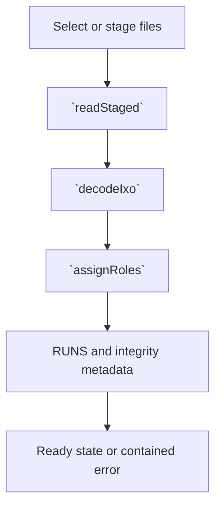
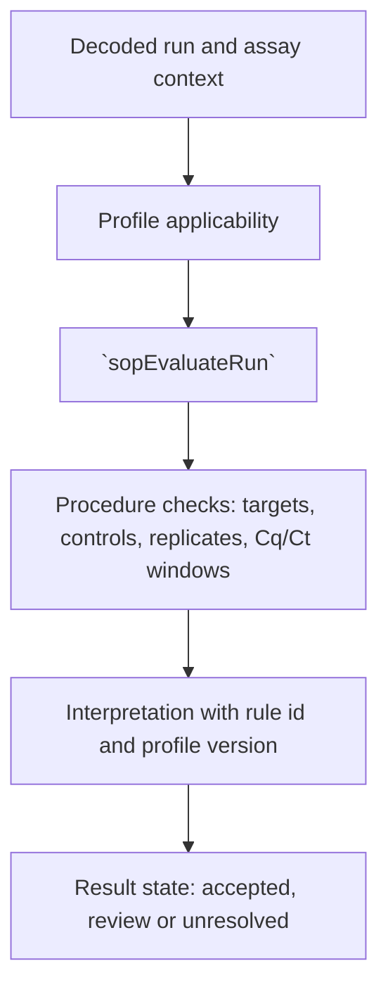
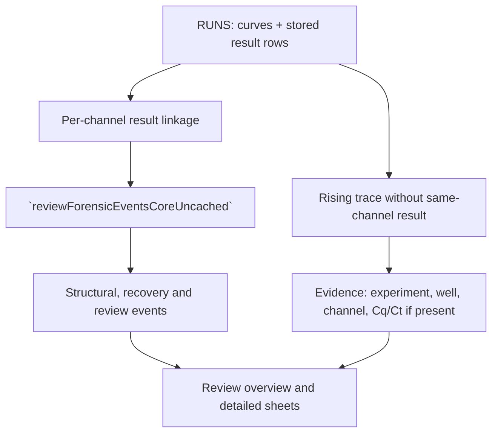
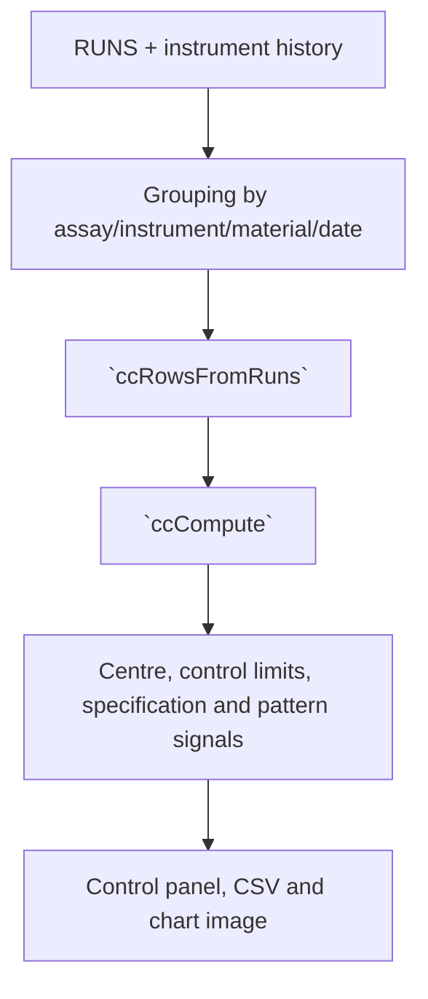
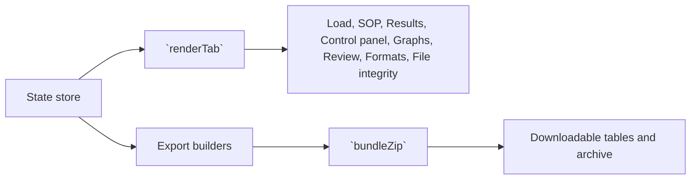

# Logical flow diagrams for the indexed HTML

These diagrams describe the current page as indexed; they are documentation only. Names in backticks are selected from the 571-entry index when present.

## 1. Intake and decoding

Input: staged file objects/bytes and generation token. Output: decoded run records, stored values, integrity metadata and notices. A malformed file or cancelled generation terminates the operation cleanly without replacing an existing complete data set.

## 2. SOP procedure and interpretation

Input: decoded targets, roles, stored Cq/Ct/calls, profile rules and procedure version. Output: rule-attributed criteria and calls; stored instrument values remain unchanged.

## 3. Review, forensic evidence and rising curves

Input: well/channel curves and only same-channel stored results. Output: deduplicated overview plus raw event log; a rising curve is not silently discarded because another channel has a result.

## 4. Control-chart computation

Input: numeric metric rows, grouping identity, baseline policy and chart options. Output: plotted values, limits, signals and explicit no-baseline states.

## 5. Views, console and exports

Input: stable state snapshot and selected view/options. Output: contained DOM render and deterministic download bytes. Rendering errors are isolated to the view and reported in the status bar.

## Relation semantics

The full DOT graph contains one node for every indexed entry and an edge when a function source names another indexed symbol. It is a static relation map, not a claim that every branch executes in one session. Runtime status is in `function_test_report.md` and `function_test_results.json`.
